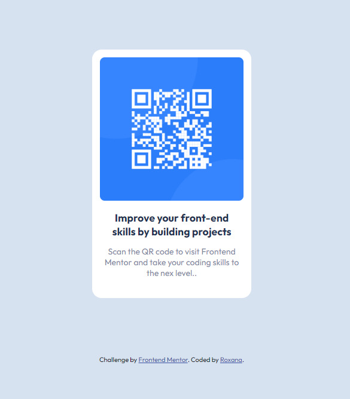

# Frontend Mentor - QR code component solution

This is a solution to the [QR code component challenge on Frontend Mentor](https://www.frontendmentor.io/challenges/qr-code-component-iux_sIO_H). Frontend Mentor challenges help you improve your coding skills by building realistic projects. 

## Table of contents

- [Overview](#overview)
  - [Screenshot](#screenshot)
  - [Links](#links)
- [My process](#my-process)
  - [Built with](#built-with)
  - [Continued development](#continued-development)
- [Author](#author)

## Overview

### Screenshot

### Links

- Solution URL: [Code](https://your-solution-url.com)
- Live Site URL: [Live](https://github.com/Roxchs/frontmentor-challenges/tree/main/qr-code-component)

## My process

### Built with

- Semantic HTML5 markup
- CSS custom properties
- Flexbox

### Continued development

This Project is my first challenge on "frontend mentor" and I want to improve the fronted area. I will try to make other versions with techniques like media query and grid to perfect other concepts.

## Author

- Frontend Mentor - [Profile](https://www.frontendmentor.io/profile/Roxchs)